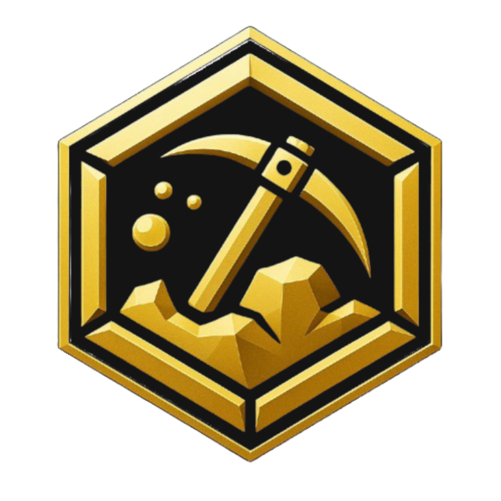

  

<h1 align="center">Gold Digger - Web3 Staking Platform and Web UI/UX Demo</h1>

  
  
  
  

  Gold Digger is a comprehensive Solana-based platform that combines NFT marketplace functionality, DeFi features, and AI-powered tools to create a unique ecosystem for crypto enthusiasts.

## ✨ Features

- **NFT Staking**: Stake your Jailbirds and Gold Digger NFTs to earn rewards
- **Token Staking**: Stake DIGR and JAIL tokens with flexible lock periods
- **Staking Analytics**: Track your staking performance and rewards
- **Leaderboard**: Compete with other stakers for the top positions
- **Calculators**: Plan your staking strategy with our compound interest and APR/APY calculators
- **Missions**: Complete missions with your NFTs to earn additional rewards
- **Rarity System**: Leverage the rarity of your NFTs for increased staking power

## 🚀 Getting Started

### Prerequisites

- Node.js 18+
- npm or yarn
- Solana wallet (Phantom, Solflare, etc.)

### Installation

1. Clone the repository:
\`\`\`bash
git clone https://github.com/gold-digg3r/staking-platform-demo.git
cd staking-platform-demo
\`\`\`

2. Install dependencies:
\`\`\`bash
npm install
# or
yarn
\`\`\`

3. Set up environment variables:
\`\`\`bash
cp .env.example .env.local
\`\`\`

4. Start the development server:
\`\`\`bash
npm run dev
# or
yarn dev
\`\`\`

5. Open [http://localhost:3000](http://localhost:3000) in your browser.

## 🔧 Environment Variables

| Variable | Description |
|----------|-------------|
| `NEXT_PUBLIC_SOLANA_NETWORK` | Solana network to connect to (devnet, testnet, mainnet-beta) |
| `NEXT_PUBLIC_RPC_ENDPOINT` | Custom RPC endpoint (optional) |
| `DIGR_TOKEN_MINT` | DIGR token mint address |
| `JAIL_TOKEN_MINT` | JAIL token mint address |
| `JAILBIRDS_COLLECTION_ADDRESS` | Jailbirds collection address |
| `GOLD_DIGGER_COLLECTION_ADDRESS` | Gold Digger collection address |
| `NFT_STAKING_ENABLED` | Enable NFT staking feature |
| `TOKEN_STAKING_ENABLED` | Enable token staking feature |
| `NEXT_PUBLIC_SUPABASE_URL` | Supabase project URL |
| `NEXT_PUBLIC_SUPABASE_ANON_KEY` | Supabase anonymous key |

## 📁 Project Structure

- `/app`: Next.js app router pages
- `/components`: React components
- `/lib`: Utility functions and services
- `/public`: Static assets
- `/server`: Server-side code and API routes
- `/data`: Static data and configuration
- `/hooks`: Custom React hooks

## 🪙 Tokens

  
  <strong>DIGR</strong> - The primary utility token of the Gold Digger ecosystem

  
  <strong>GOLD</strong> - Token associated with the Gold Digger NFT collection

  
  <strong>JAIL</strong> - Token associated with the Jailbirds NFT collection

## 🔄 Staking Mechanics

Gold Digger implements a sophisticated staking system with the following features:

- **NFT Staking**: Stake NFTs from supported collections to earn DIGR tokens
- **Token Staking**: Stake DIGR, GOLD, or JAIL tokens with various lock periods for higher APY
- **Rarity Multipliers**: Higher rarity NFTs provide increased staking power
- **Auto-compounding**: Automatically reinvest rewards for exponential growth
- **Leaderboard Rewards**: Top stakers receive additional bonuses

## 🎮 Missions

Complete missions with your staked NFTs to earn additional rewards:

- **Mission Types**: Various mission types with different difficulty levels
- **Team Composition**: Strategic team building with complementary abilities
- **Reward Structure**: Earn DIGR tokens, rare NFT drops, and leaderboard points
- **Success Rates**: Higher rarity NFTs increase mission success probability

## 📊 Analytics

Track your staking performance with comprehensive analytics:

- **Staking Dashboard**: Overview of all your staked assets
- **Reward Projections**: Estimate future rewards based on current rates
- **Historical Performance**: View your staking history and earnings
- **Leaderboard Position**: Track your ranking among other stakers

## 🛠️ Technologies

- **Frontend**: Next.js, React, TypeScript, Tailwind CSS
- **Blockchain**: Solana, Web3.js
- **Authentication**: Wallet authentication (Phantom, Solflare)
- **Database**: Supabase
- **Styling**: shadcn/ui components

## 📄 License

This project is licensed under the MIT License - see the [LICENSE](LICENSE) file for details.

## 🙏 Acknowledgments

- Solana Foundation
- Next.js Team
- shadcn/ui
